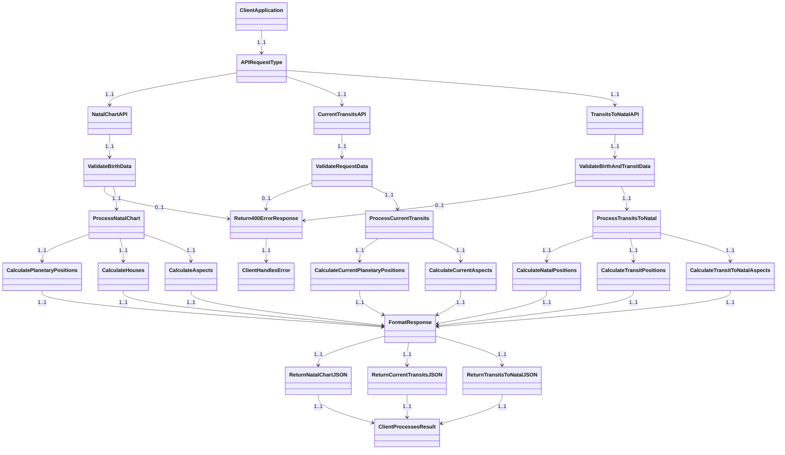

```mermaid
classDiagram
    class ClientApplication
    class APIRequestType
    class NatalChartAPI
    class CurrentTransitsAPI
    class TransitsToNatalAPI
    class ValidateBirthData
    class ValidateRequestData
    class ValidateBirthAndTransitData
    class ProcessNatalChart
    class ProcessCurrentTransits
    class ProcessTransitsToNatal
    class CalculatePlanetaryPositions
    class CalculateHouses
    class CalculateAspects
    class CalculateCurrentPlanetaryPositions
    class CalculateCurrentAspects
    class CalculateNatalPositions
    class CalculateTransitPositions
    class CalculateTransitToNatalAspects
    class FormatResponse
    class ReturnNatalChartJSON
    class ReturnCurrentTransitsJSON
    class ReturnTransitsToNatalJSON
    class Return400ErrorResponse
    class ClientHandlesError
    class ClientProcessesResult

    ClientApplication --> APIRequestType : 1..1
    APIRequestType --> NatalChartAPI : 1..1
    APIRequestType --> CurrentTransitsAPI : 1..1
    APIRequestType --> TransitsToNatalAPI : 1..1

    NatalChartAPI --> ValidateBirthData : 1..1
    CurrentTransitsAPI --> ValidateRequestData : 1..1
    TransitsToNatalAPI --> ValidateBirthAndTransitData : 1..1

    ValidateBirthData --> Return400ErrorResponse : 0..1
    ValidateRequestData --> Return400ErrorResponse : 0..1
    ValidateBirthAndTransitData --> Return400ErrorResponse : 0..1

    ValidateBirthData --> ProcessNatalChart : 1..1
    ValidateRequestData --> ProcessCurrentTransits : 1..1
    ValidateBirthAndTransitData --> ProcessTransitsToNatal : 1..1

    ProcessNatalChart --> CalculatePlanetaryPositions : 1..1
    ProcessNatalChart --> CalculateHouses : 1..1
    ProcessNatalChart --> CalculateAspects : 1..1

    ProcessCurrentTransits --> CalculateCurrentPlanetaryPositions : 1..1
    ProcessCurrentTransits --> CalculateCurrentAspects : 1..1

    ProcessTransitsToNatal --> CalculateNatalPositions : 1..1
    ProcessTransitsToNatal --> CalculateTransitPositions : 1..1
    ProcessTransitsToNatal --> CalculateTransitToNatalAspects : 1..1

    CalculatePlanetaryPositions --> FormatResponse : 1..1
    CalculateHouses --> FormatResponse : 1..1
    CalculateAspects --> FormatResponse : 1..1

    CalculateCurrentPlanetaryPositions --> FormatResponse : 1..1
    CalculateCurrentAspects --> FormatResponse : 1..1

    CalculateNatalPositions --> FormatResponse : 1..1
    CalculateTransitPositions --> FormatResponse : 1..1
    CalculateTransitToNatalAspects --> FormatResponse : 1..1

    FormatResponse --> ReturnNatalChartJSON : 1..1
    FormatResponse --> ReturnCurrentTransitsJSON : 1..1
    FormatResponse --> ReturnTransitsToNatalJSON : 1..1

    Return400ErrorResponse --> ClientHandlesError : 1..1
    ReturnNatalChartJSON --> ClientProcessesResult : 1..1
    ReturnCurrentTransitsJSON --> ClientProcessesResult : 1..1
    ReturnTransitsToNatalJSON --> ClientProcessesResult : 1..1
```